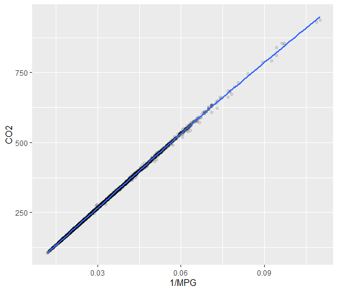
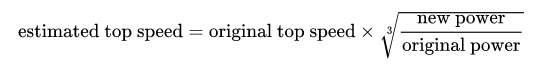

```{r setup, include=FALSE}
knitr::opts_chunk$set(echo = FALSE)
library(tidyverse)
library(ggplot2)
library(corrplot)
library(modelr)
rethink = read_csv("rethink.csv") #read the database
```

## Car pollution... What to blame?

Everyone can dream about an ideal cars that perfectly match his needs.

## But...

Since the environment needs to be preserved, what should limit governments and manufacturers?  
  
We will split cars in some big groups:  
- **City cars**  
- **Long-distance cars**  
- **Off-road vehicles**  
- **Sport cars**  
  
Let's do some ipothesis with interesting data...

## Correlation between CO2 and MPG
{height=350px}
```{r pressure}
cor(1/(rethink %>% filter (MPG > 0 & CO2 > 0 & Fuel == "Tier 2 Cert Gasoline"))$MPG, (rethink %>% filter (MPG > 0 & CO2 > 0 & Fuel == "Tier 2 Cert Gasoline"))$CO2)
```
## Weight

- Sports cars: heaviest mass at the bottom  
- Off road vehicles: total weight lowest as possible

## Horsepower

- Sport cars: needed to reach higher speed and better acceleration  

## Cylinders

- Sport cars and long-distance cars: not too little in order to reduce vibration

## Gears and air drag coefficient

  
We can also increase the maximum speed by reducing the acceleration changing gears ratio.  

- Sport cars: maximize the maximum speed  
- City cars: acceleration over maximum speed  
- Off-road cars: maximize acceleration (reduced gears)

## Conclusion

Everyone would decrease emissions, we have to keep in mind different type of cars meets different needs and have different aims.

## Bibliography

- Data source: https://www.epa.gov/sites/production/files/2021-03/21tstcar-2021-03-02.xlsx  
- Drag coefficient: https://en.wikipedia.org/wiki/Automobile_drag_coefficient
